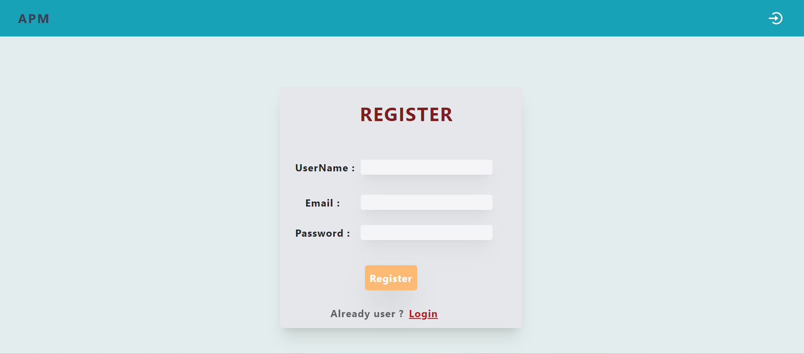
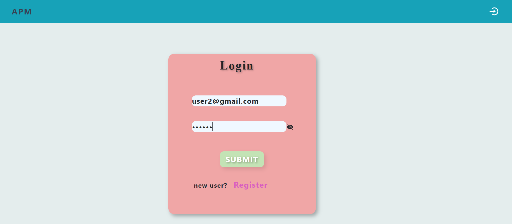
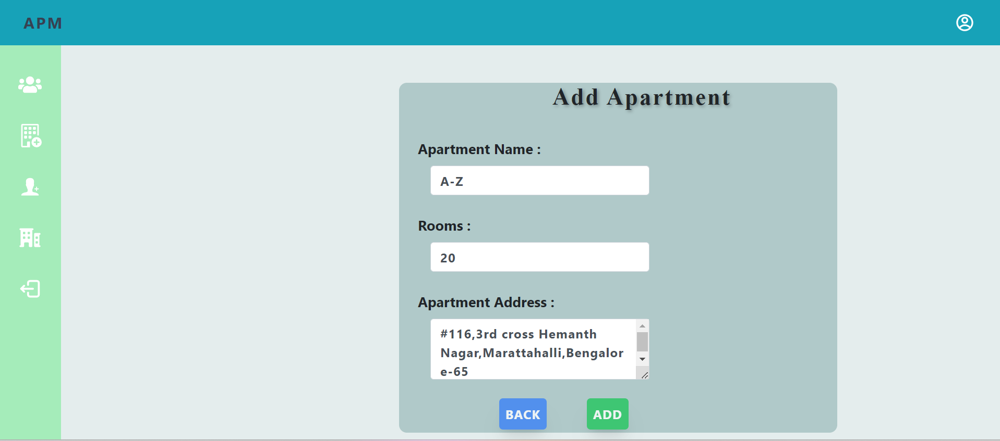
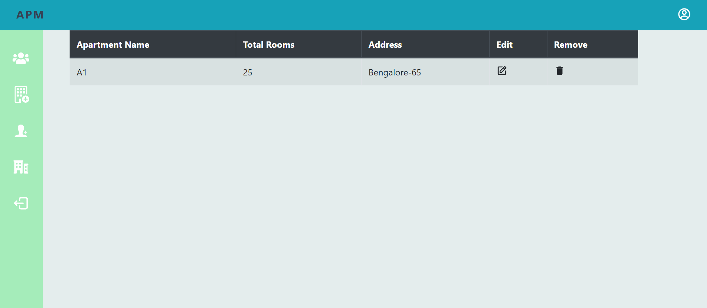
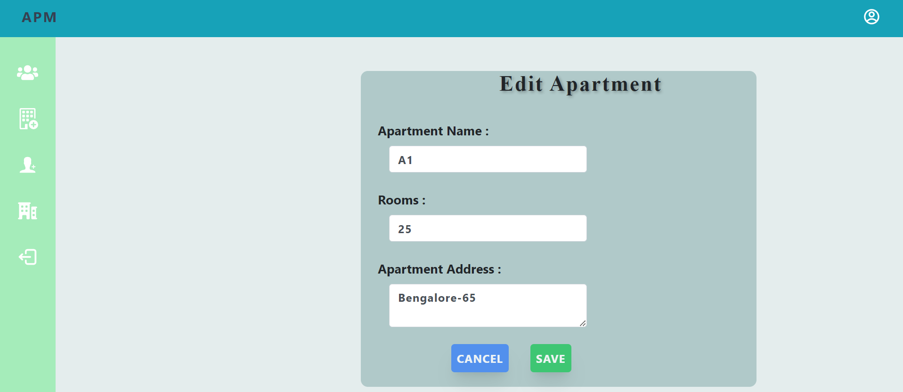
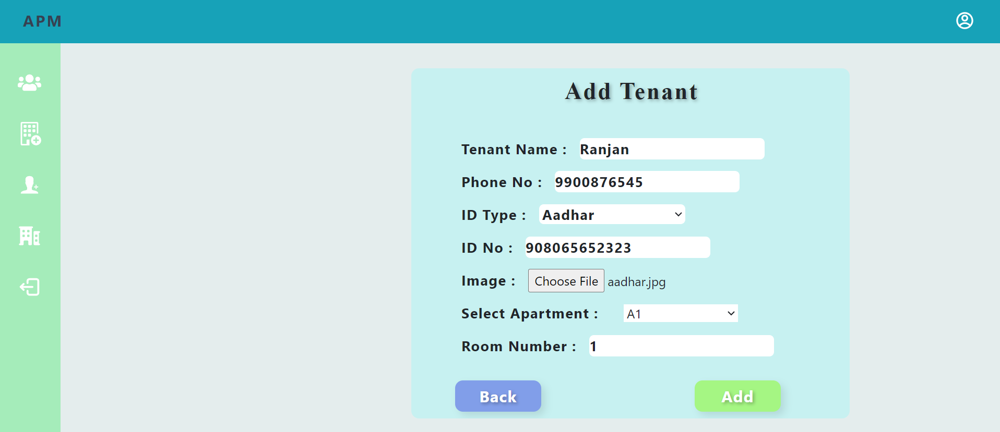
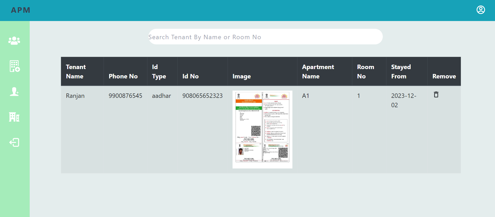
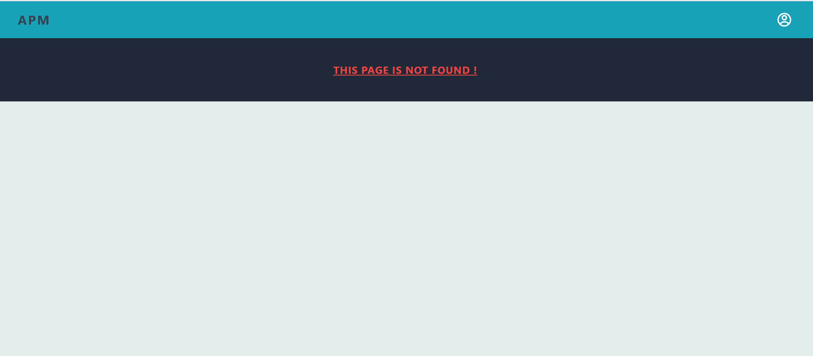

"# Apartment_Management_System"

### Folder Structure

Below is the Folder structure of the codebase:

```
├── README.md
├── client # front-end code
│   ├── pulic
│   ├── src
        ├── components
            ├── Account
            ├── AxiosInstance
            ├── Home
            ├── Images
            ├── Login
            ├── Navnar
            ├── PageNotFound
            ├── ProtectedRoutes
            ├── Register
│   ├── App.js
│   ├── index.css
│   └── index.js
├── server  # backend code
│   ├── App
│   │   ├── controller
│   │   ├── middleware
│   │   ├── module
│   ├── Config
│   │   ├── dbConnection.js
│   │   ├── router.js
│   └── index.js
```

### TECH STACK & PACKAGES USED in front-end
- react
- Bootstrap
- tailwindCSS
- axios
- react-router-dom
- toast

### TECH STACK & PACKAGES USED in Back-end
- NodeJS
- ExpressJS
- cors
- bodyParser
- mongoose
- multer
- validator

Step-1 : Register Page


Step-2 : Login Page


Step-3 : Add_Apartment


Step-4 : All_Apartment


Step-5 : Edit_Apartment


Step-6 : Add_Tennants


Step-7 : All_Tennants


Step-8 : Page_Not_Found

